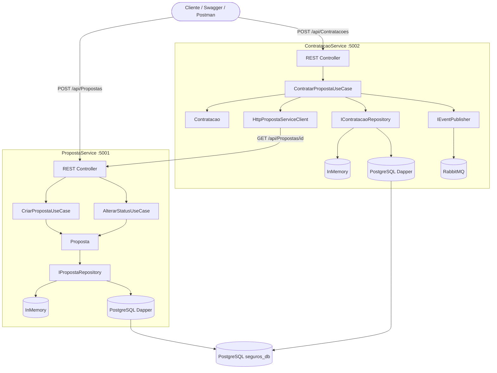

# Proposta de Seguros

Sistema de gerenciamento de propostas de seguro desenvolvido como teste técnico,
utilizando Arquitetura Hexagonal (Ports & Adapters), .NET 10 e PostgreSQL.

## Visão Geral 

O sistema é composto por dois microserviços independentes:

| Serviço | Responsabilidade | Porta |
|---|---|---|
| **PropostaService** | Criar e gerenciar propostas de seguro | 5001 |
| **ContratacaoService** | Contratar propostas aprovadas e publicar eventos | 5002 |

---

## Diagrama Funcional



<details>
<summary><strong>Como o sistema funciona</strong></summary>

<br>

O cliente (Swagger, Postman ou aplicação front-end) interage com dois serviços independentes via HTTP REST.

**PropostaService** recebe a solicitação de seguro, valida o CPF e as regras de negócio por tipo de produto (Strategy Pattern) e persiste a proposta com status `EmAnalise`. O repositório é intercambiável via feature flag: `InMemory` para desenvolvimento, `PostgreSQL via Dapper` para produção.

**ContratacaoService** recebe a requisição de contratação, consulta o PropostaService via HTTP para confirmar que a proposta existe e está aprovada, persiste a contratação e publica o evento `PropostaContratadaEvent` no RabbitMQ. A publicação é opcional (feature flag) e, caso o RabbitMQ esteja indisponível, o `NullEventPublisher` garante que a API não falhe — a contratação é salva normalmente.

Ambos os serviços compartilham o mesmo banco `seguros_db`, segregados por schemas (`proposta` e `contratacao`).

</details>

---

## Tecnologias

- .NET 10 / C#
- PostgreSQL 16 + Dapper
- RabbitMQ 4 (mensageria — bônus)
- FluentValidation
- xUnit / Moq / Bogus / FluentAssertions
- Docker / Docker Compose
- Swagger / OpenAPI 3.0
- ASP.NET Health Checks

---

## Tipos de Seguro

| Código | Tipo | Valor Mínimo |
|--------|------|--------------| 
| 1 | SeguroFGTSProtegido | R$ 50,00 |
| 2 | SeguroVidaFamiliar | R$ 30,00 |
| 3 | SeguroCartaoProtegido | R$ 15,00 |
| 4 | ProtecaoCreditoTrabalhador | R$ 25,00 |
| 5 | SeguroContaCelularProtegidos | R$ 10,00 |

---

## Estrutura Organizacional

```
proposta-seguros/
├── src/
│   ├── PropostaService/
│   │   ├── PropostaService.Api/          # Controllers, DI, Program.cs
│   │   ├── PropostaService.Application/  # Use Cases, DTOs, interfaces de entrada
│   │   ├── PropostaService.Domain/       # Entidades, Ports (interfaces), regras
│   │   └── PropostaService.Infrastructure/ # Adapters: Dapper, InMemory, HTTP
│   └── ContratacaoService/
│       ├── ContratacaoService.Api/
│       ├── ContratacaoService.Application/
│       ├── ContratacaoService.Domain/
│       └── ContratacaoService.Infrastructure/
├── tests/
│   ├── PropostaService.Tests/            # 13 testes unitários
│   └── ContratacaoService.Tests/
├── migrations/                           # SQL versionado V001–V005
├── scripts/                              # Shell scripts de operação VPS
├── docs/
│   ├── postman/                          # Collection + environments
│   └── enunciado.md
├── docker-compose.yml
├── .env.example
└── proposta-seguros.sln
```

### Principais classes e responsabilidades

| Camada | Classe / Interface | Responsabilidade |
|--------|--------------------|-----------------|
| Domain | `Proposta` | Entidade principal — encapsula status e regras de transição |
| Domain | `IPropostaRepository` | Port de saída — contrato de persistência |
| Domain | `IRegraSeguro` | Port — Strategy de validação por tipo de seguro |
| Domain | `SeguroFactory` | Factory — retorna a implementação correta de `IRegraSeguro` |
| Application | `CriarPropostaUseCase` | Orquestra criação e validação da proposta |
| Application | `ContratarPropostaUseCase` | Orquestra contratação, consulta ao PropostaService e publicação de evento |
| Application | `Result<T>` | Encapsula sucesso ou falha sem lançar exceções de controle de fluxo |
| Infrastructure | `DapperPropostaRepository` | Adapter — implementa `IPropostaRepository` com SQL explícito via Dapper |
| Infrastructure | `InMemoryPropostaRepository` | Adapter — implementa `IPropostaRepository` com `List<T>` em memória |
| Infrastructure | `RabbitMqEventPublisher` | Adapter — publica `PropostaContratadaEvent` no RabbitMQ |
| Infrastructure | `NullEventPublisher` | Null Object — substitui RabbitMQ quando desabilitado, sem falhar |
| Infrastructure | `HttpPropostaServiceClient` | Adapter — consulta o PropostaService via HTTP |
| Api | `PropostasController` | Entrada HTTP — delega para Use Cases, mapeia para status codes |

---

## Como Executar

### Opção 1 — Docker na VPS (recomendado)

```bash
ssh root@2.25.122.11
cd /home/projetos/proposta-seguros
./scripts/apply.sh
```

### Opção 2 — Docker local

```bash
git clone https://github.com/josehelioaraujo/proposta-seguros.git
cd proposta-seguros
cp .env.example .env
docker compose up --build -d
```

### Opção 3 — Local sem Docker

```bash
# Terminal 1 — PropostaService
cd src/PropostaService/PropostaService.Api
dotnet run

# Terminal 2 — ContratacaoService
cd src/ContratacaoService/ContratacaoService.Api
dotnet run
```

---

## URLs

### VPS Hostinger

| Serviço | URL |
|---|---|
| PropostaService — Swagger | http://2.25.122.11:5001 |
| ContratacaoService — Swagger | http://2.25.122.11:5002 |
| RabbitMQ — Painel | http://2.25.122.11:15672 |

### Local

| Serviço | URL |
|---|---|
| PropostaService — Swagger | http://localhost:5001 |
| ContratacaoService — Swagger | http://localhost:5002 |
| RabbitMQ — Painel | http://localhost:15672 |

---

## Endpoints

### PropostaService

| Método | Rota | Descrição | Status |
|--------|------|-----------|--------|
| POST | /api/Propostas | Cria uma proposta | 201 |
| GET | /api/Propostas | Lista todas as propostas | 200 |
| GET | /api/Propostas/{id} | Busca proposta por ID | 200 |
| PATCH | /api/Propostas/{id}/status | Altera status da proposta | 200 |

### ContratacaoService

| Método | Rota | Descrição | Status |
|--------|------|-----------|--------|
| POST | /api/Contratacoes | Contrata uma proposta aprovada | 201 |
| GET | /api/Contratacoes/{id} | Busca contratação por ID | 200 |

### Health Checks

| Endpoint | PropostaService | ContratacaoService |
|----------|-----------------|-------------------|
| /health | :5001/health | :5002/health |
| /health/live | :5001/health/live | :5002/health/live |
| /health/ready | :5001/health/ready | :5002/health/ready |

---

## Migrations SQL

As migrations criam os schemas e tabelas no PostgreSQL.

### Aplicar na VPS

```bash
cd /home/projetos/proposta-seguros

docker exec -i seguros-postgres psql -U postgres -d seguros_db < migrations/V001__create_schema_proposta.sql
docker exec -i seguros-postgres psql -U postgres -d seguros_db < migrations/V002__create_table_propostas.sql
docker exec -i seguros-postgres psql -U postgres -d seguros_db < migrations/V003__create_schema_contratacao.sql
docker exec -i seguros-postgres psql -U postgres -d seguros_db < migrations/V004__create_table_contratacoes.sql
```

### Estrutura criada

```
seguros_db
├── schema: proposta
│   └── tabela: propostas
│       ├── id, nome_cliente, cpf
│       ├── tipo_seguro, valor, status
│       └── criado_em, atualizado_em
│
└── schema: contratacao
    └── tabela: contratacoes
        ├── id, proposta_id
        ├── cpf, data_contratacao
```

---

## Testes de Unidade

```bash
dotnet test .\proposta-seguros.sln
```

```
Resultado esperado:
total: 13 | falhou: 0 | bem-sucedido: 13
```

---

## Testando via Postman

### 1. Importar os arquivos

```
Postman -> Import -> seleciona os 3 arquivos da pasta docs/postman/:
├── proposta-seguros.postman_collection.json
├── env-local.json
└── env-vps.json
```

### 2. Selecionar o ambiente

```
Canto superior direito do Postman:
├── "Local"          -> http://localhost:500x
└── "VPS Hostinger"  -> http://2.25.122.11:500x
```

### 3. Estrutura da Collection

| Pasta | Descrição |
|-------|-----------|
| 01 — Health Checks | Verifica saúde dos dois serviços |
| 02 — PropostaService | Todos os cenários de proposta |
| 03 — ContratacaoService | Todos os cenários de contratação |
| 04 — Fluxo Completo | Fluxo end-to-end com dados fixos |
| 05 — Fluxo VPS InMemory | Dados aleatórios — sem banco |
| 06 — Fluxo VPS PostgreSQL | Dados aleatórios — com banco |
| 07 — Fluxo VPS PostgreSQL + RabbitMQ | Dados aleatórios — banco + fila |

---

## Simulação Completa de Testes

### Cenário 1 — InMemory

```bash
# Na VPS
./scripts/set-banco.sh --disable
```

```
Postman: ambiente "VPS Hostinger"
Pasta:   "05 — Fluxo VPS InMemory"
Ação:    Run folder -> Start run

Resultado esperado:
- 7/7 testes passando
- Dados gerados automaticamente
- Fluxo: criar -> aprovar -> contratar -> verificar
```

### Cenário 2 — PostgreSQL

```bash
# Aplica migrations
docker exec -i seguros-postgres psql -U postgres -d seguros_db < migrations/V001__create_schema_proposta.sql
docker exec -i seguros-postgres psql -U postgres -d seguros_db < migrations/V002__create_table_propostas.sql
docker exec -i seguros-postgres psql -U postgres -d seguros_db < migrations/V003__create_schema_contratacao.sql
docker exec -i seguros-postgres psql -U postgres -d seguros_db < migrations/V004__create_table_contratacoes.sql

# Liga PostgreSQL
./scripts/set-banco.sh --enable
```

```
Postman: ambiente "VPS Hostinger"
Pasta:   "06 — Fluxo VPS PostgreSQL"
Ação:    Run folder -> Start run

Resultado esperado:
- 7/7 testes passando
- Dados persistidos no PostgreSQL
- Health check mostra postgres: Healthy
```

### Cenário 3 — PostgreSQL + RabbitMQ

```bash
# Liga RabbitMQ
./scripts/set-rabbitmq.sh --enable
```

```
Postman: ambiente "VPS Hostinger"
Pasta:   "07 — Fluxo VPS PostgreSQL + RabbitMQ"
Ação:    Run folder -> Start run

Resultado esperado:
- 7/7 testes passando
- Evento PropostaContratadaEvent publicado na fila
- Health check mostra postgres + rabbitmq: Healthy

Verifica a fila:
URL:     http://2.25.122.11:15672
Usuário: guest / Senha: guest
Fila:    proposta.contratada.queue
```

---

## Feature Flags

| Flag | false (padrão) | true |
|------|----------------|------|
| Features:UsarBancoDados | InMemory | PostgreSQL via Dapper |
| Features:UsarRabbitMQ | Sem mensageria | Publica PropostaContratadaEvent |

### Scripts de operação (VPS)

```bash
./scripts/apply.sh                    # aplica flags do .env e sobe containers
./scripts/set-banco.sh --enable       # liga PostgreSQL
./scripts/set-banco.sh --disable      # volta para InMemory
./scripts/set-rabbitmq.sh --enable    # liga RabbitMQ
./scripts/set-rabbitmq.sh --disable   # desliga RabbitMQ
./scripts/update.sh                   # git pull + rebuild
./scripts/status.sh                   # status dos containers e URLs
./scripts/logs.sh --proposta          # logs PropostaService
./scripts/logs.sh --contratacao       # logs ContratacaoService
./scripts/logs.sh --all               # todos os logs
```

---

## Bônus

### RabbitMQ — Mensageria

O enunciado menciona mensageria como item opcional. O ContratacaoService publica
o evento PropostaContratadaEvent após cada contratação bem-sucedida.

```
Evento: PropostaContratadaEvent
Exchange: proposta.exchange (Direct)
Fila:     proposta.contratada.queue

Consumidores em produção real:
- ApoliceService   -> gera documento da apólice
- CobrancaService  -> agenda débito mensal
- NotificacaoService -> envia e-mail ao cliente
- SusepService     -> registro regulatório
```

Feature flag: Features:UsarRabbitMQ

### Health Checks — ASP.NET Nativo

Implementados usando o sistema nativo do ASP.NET Core sem bibliotecas externas,
com três níveis de verificação por serviço.

```
PropostaService    -> self + postgres (se habilitado)
ContratacaoService -> self + postgres + proposta-service + rabbitmq
```

### PostgreSQL + Dapper com Feature Flag

O sistema opera em dois modos sem alteração de código:

```
UsarBancoDados: false -> InMemory (List<T>) — desenvolvimento
UsarBancoDados: true  -> PostgreSQL via Dapper — produção
```

Demonstra o padrão Ports & Adapters na prática: o mesmo Use Case funciona
com qualquer repositório injetado via DI.

### Logging Estruturado

Logging implementado em todos os Use Cases com níveis configurados por ambiente
via appsettings.json, preparado para integração futura com Prometheus e Grafana.

### Docker — Multi-stage Build

Imagens construídas em duas etapas: SDK para compilar, runtime para executar.
Resultado: imagem final de aproximadamente 200MB ao invés de 900MB, sem código
fonte exposto e sem ferramentas de build em produção.

### Deploy em VPS

Sistema em execução em VPS real na Hostinger (Ubuntu 24.04, Docker 29.7.2),
acessível publicamente para avaliação sem necessidade de setup local.

```
PropostaService:    http://2.25.122.11:5001
ContratacaoService: http://2.25.122.11:5002
```

---

## Documentação

- [Enunciado do Projeto](docs/enunciado.md)
- [Postman Collection](docs/postman/)
- [Migrations SQL](migrations/)

---

## Containers Docker

| Container | Imagem | Porta | Descrição |
|-----------|--------|-------|-----------|
| proposta-api | proposta-seguros-proposta-api | 5001 | API de gerenciamento de propostas de seguro |
| contratacao-api | proposta-seguros-contratacao-api | 5002 | API de contratação de propostas aprovadas |
| seguros-postgres | postgres:16-alpine | 5432 | Banco de dados PostgreSQL compartilhado |
| seguros-rabbitmq | rabbitmq:4-management-alpine | 5672 / 15672 | Mensageria — sobe apenas com profile rabbitmq |

### Observações

```
proposta-api e contratacao-api
└── Multi-stage build: sdk:10.0 (build) + aspnet:10.0 (runtime)
└── Imagem final: ~200MB (sem SDK, sem código fonte)
└── Ambiente: Production

seguros-postgres
└── Volume persistente: postgres_data
└── Healthcheck: pg_isready a cada 10s
└── APIs só sobem após postgres estar Healthy

seguros-rabbitmq
└── Sobe apenas quando USAR_RABBITMQ=true
└── Painel de gerenciamento: http://2.25.122.11:15672
└── usuário: guest / senha: guest
```

---

## Scripts de Operação

Todos os scripts ficam na pasta `scripts/` e devem ser executados
a partir da raiz do projeto na VPS.

### Gerenciamento de containers

| Script | Descrição |
|--------|-----------| 
| `./scripts/start.sh` | Inicia os containers |
| `./scripts/stop.sh` | Para os containers |
| `./scripts/restart.sh` | Reinicia os containers |
| `./scripts/status.sh` | Exibe status dos containers e URLs |
| `./scripts/update.sh` | git pull + rebuild + reinicia |

### Feature flags

| Script | Descrição |
|--------|-----------|
| `./scripts/set-banco.sh --enable` | Liga PostgreSQL (Dapper) |
| `./scripts/set-banco.sh --disable` | Volta para InMemory |
| `./scripts/set-rabbitmq.sh --enable` | Liga RabbitMQ e sobe o container |
| `./scripts/set-rabbitmq.sh --disable` | Desliga RabbitMQ |
| `./scripts/apply.sh` | Aplica as flags do .env e reinicia |

### Logs

| Script | Descrição |
|--------|-----------|
| `./scripts/logs.sh --proposta` | Logs do PropostaService em tempo real |
| `./scripts/logs.sh --contratacao` | Logs do ContratacaoService em tempo real |
| `./scripts/logs.sh --postgres` | Logs do PostgreSQL em tempo real |
| `./scripts/logs.sh --all` | Logs de todos os containers |

### Como usar

```bash
# Conecta na VPS
ssh root@2.25.122.11
cd /home/projetos/proposta-seguros

# Verifica status atual
./scripts/status.sh

# Atualiza para última versão
./scripts/update.sh

# Alterna para PostgreSQL
./scripts/set-banco.sh --enable

# Acompanha logs em tempo real
./scripts/logs.sh --proposta
```

### Arquivo .env

O arquivo `.env` na raiz do projeto persiste as feature flags entre reinicializações:

```bash
# Ver flags atuais
cat .env

# Conteúdo esperado:
USAR_BANCO_DADOS=false
USAR_RABBITMQ=false
```

Os scripts `set-banco.sh` e `set-rabbitmq.sh` atualizam o `.env` automaticamente.

---

## Mensageria — Produtor e Consumidores

Nossa aplicação atua apenas como **produtora** de eventos. O ContratacaoService
publica o evento `PropostaContratadaEvent` na fila após cada contratação
bem-sucedida e não se preocupa com o que acontece a seguir — esse é o
princípio do desacoplamento via mensageria.

### O que publicamos

```
Evento: PropostaContratadaEvent
Exchange: proposta.exchange (Direct)
Fila:     proposta.contratada.queue

Campos:
├── ContratacaoId    — identificador único da contratação
├── PropostaId       — referência à proposta contratada
├── Cpf              — CPF do segurado
├── DataContratacao  — data e hora da contratação
└── OcorridoEm       — timestamp do evento
```

### Quem consumiria em produção real

Cada consumidor é um microserviço independente que escuta a fila
e reage ao evento de forma autônoma:

| Consumidor | Responsabilidade |
|------------|-----------------|
| **ApoliceService** | Gera o documento PDF da apólice de seguro e disponibiliza para o segurado |
| **CobrancaService** | Agenda o débito mensal do prêmio na conta ou cartão do segurado |
| **NotificacaoService** | Envia e-mail e SMS de confirmação da contratação ao segurado |
| **SusepService** | Registra a contratação junto à SUSEP (órgão regulador de seguros) dentro do prazo legal de 24h |
| **AntiFraudeService** | Analisa o perfil do segurado e a contratação em busca de padrões suspeitos |
| **AuditoriaService** | Registra todos os eventos em log imutável para fins de compliance e rastreabilidade |

### Por que mensageria e não HTTP direto

```
Sem mensageria (HTTP síncrono):
└── ContratacaoService chama cada serviço diretamente
    ├── Se NotificacaoService cair  → contratação falha
    ├── Se CobrancaService lento    → resposta demora
    └── Acoplamento alto entre serviços

Com mensageria (assíncrono):
└── ContratacaoService publica o evento e retorna 201
    ├── Cada consumidor processa no seu próprio ritmo
    ├── Se um cair, a mensagem fica na fila até ele voltar
    ├── Escala independente por serviço
    └── Desacoplamento total
```

### Como verificar as mensagens publicadas

Após rodar o fluxo 07 no Postman, acesse o painel do RabbitMQ:

```
URL:     http://2.25.122.11:15672
Usuário: guest
Senha:   guest

Queues and Streams
└── proposta.contratada.queue
    └── Messages ready: N (mensagens aguardando consumidor)
```

As mensagens ficam acumuladas pois não há consumidores implementados
neste projeto — em produção real seriam processadas imediatamente.

---

## Painéis Administrativos

### Adminer — PostgreSQL

Interface web para visualizar e consultar o banco de dados PostgreSQL.

```bash
# Sobe o Adminer
./scripts/set-adminer.sh --enable

# Para o Adminer
./scripts/set-adminer.sh --disable
```

```
URL:      http://2.25.122.11:5050
Sistema:  PostgreSQL
Servidor: postgres
Usuário:  postgres
Senha:    postgres
Banco:    seguros_db
```

Tabelas disponíveis:

```
seguros_db
├── proposta.propostas       — propostas de seguro criadas
└── contratacao.contratacoes — contratações realizadas
```

---

### RabbitMQ Management — Mensageria

Interface web nativa do RabbitMQ para monitorar filas e mensagens.

```
URL:     http://2.25.122.11:15672
Usuário: guest
Senha:   guest
```

O que monitorar após rodar o fluxo com RabbitMQ habilitado:

```
Queues and Streams
└── proposta.contratada.queue
    ├── Messages ready   — mensagens aguardando consumidor
    ├── Message rates    — taxa de publicação
    └── Get messages     — visualiza o conteúdo do evento
```

Para ver o conteúdo de uma mensagem:

```
Queues → proposta.contratada.queue
→ Get messages → Ackmode: Nack → Get Message(s)
```

Conteúdo esperado:

```json
{
  "ContratacaoId":   "48988e73-6c65-46f6-b10d-8b8352111df2",
  "PropostaId":      "c13f6050-1426-48f9-83ae-41d7133fa7ba",
  "Cpf":             "120.147.173-70",
  "DataContratacao": "2026-08-30T00:54:47",
  "OcorridoEm":      "2026-08-30T00:54:47"
}
```