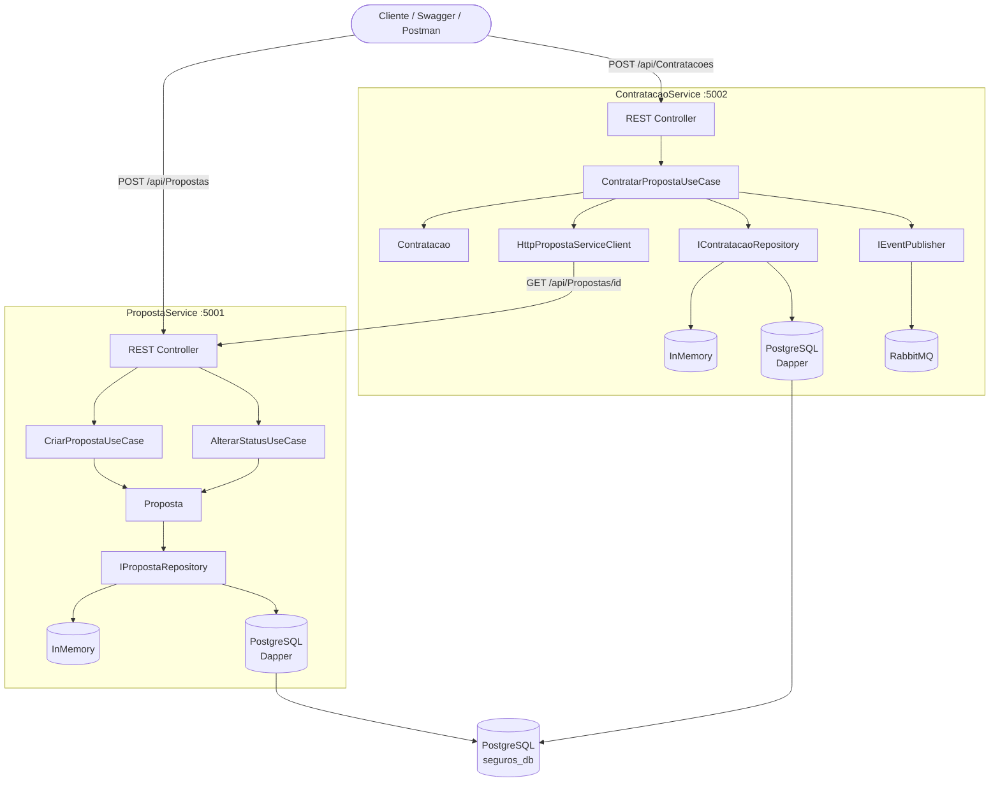

# 🛡️ Proposta de Seguros

Sistema de gerenciamento de propostas de seguro desenvolvido como teste técnico,
utilizando Arquitetura Hexagonal (Ports & Adapters), .NET 10 e PostgreSQL.

## Visão Geral

O sistema é composto por dois microserviços independentes:

| Serviço | Responsabilidade | Porta |
|---|---|---|
| **PropostaService** | Criar e gerenciar propostas de seguro | 5001 |
| **ContratacaoService** | Contratar propostas aprovadas e publicar eventos | 5002 |

---

## Arquitetura



---

## Tecnologias

- .NET 10 · C#
- PostgreSQL 16 + Dapper
- RabbitMQ 4 (mensageria — bônus)
- FluentValidation
- xUnit · Moq · Bogus · FluentAssertions
- Docker · Docker Compose
- Swagger / OpenAPI 3.0
- ASP.NET Health Checks

---

## Tipos de Seguro (BMG)

| Código | Tipo | Valor Mínimo |
|--------|------|--------------|
| 1 | SeguroFGTSProtegido | R$ 50,00 |
| 2 | SeguroVidaFamiliar | R$ 30,00 |
| 3 | SeguroCartaoProtegido | R$ 15,00 |
| 4 | ProtecaoCreditoTrabalhador | R$ 25,00 |
| 5 | SeguroContaCelularProtegidos | R$ 10,00 |

---

## Como Executar

### Opção 1 — Docker na VPS (recomendado)

```bash
ssh root@2.25.122.11
cd /home/projetos/proposta-seguros
./scripts/apply.sh
```

### Opção 2 — Docker local

```bash
git clone https://github.com/josehelioaraujo/proposta-seguros.git
cd proposta-seguros
cp .env.example .env
docker compose up --build -d
```

### Opção 3 — Local sem Docker

```bash
# Terminal 1 — PropostaService
cd src/PropostaService/PropostaService.Api
dotnet run

# Terminal 2 — ContratacaoService
cd src/ContratacaoService/ContratacaoService.Api
dotnet run
```

---

## URLs

### VPS Hostinger

| Serviço | URL |
|---|---|
| PropostaService — Swagger | http://2.25.122.11:5001 |
| ContratacaoService — Swagger | http://2.25.122.11:5002 |
| RabbitMQ — Painel | http://2.25.122.11:15672 |

### Local

| Serviço | URL |
|---|---|
| PropostaService — Swagger | http://localhost:5001 |
| ContratacaoService — Swagger | http://localhost:5002 |
| RabbitMQ — Painel | http://localhost:15672 |

---

## Endpoints

### PropostaService

| Método | Rota | Descrição | Status |
|--------|------|-----------|--------|
| POST | /api/Propostas | Cria uma proposta | 201 |
| GET | /api/Propostas | Lista todas as propostas | 200 |
| GET | /api/Propostas/{id} | Busca proposta por ID | 200 |
| PATCH | /api/Propostas/{id}/status | Altera status da proposta | 200 |

### ContratacaoService

| Método | Rota | Descrição | Status |
|--------|------|-----------|--------|
| POST | /api/Contratacoes | Contrata uma proposta aprovada | 201 |
| GET | /api/Contratacoes/{id} | Busca contratação por ID | 200 |

### Health Checks

| Endpoint | Descrição | PropostaService | ContratacaoService |
|----------|-----------|-----------------|-------------------|
| /health | Status geral de todos os checks | :5001/health | :5002/health |
| /health/live | Liveness — API está viva? | :5001/health/live | :5002/health/live |
| /health/ready | Readiness — dependências ok? | :5001/health/ready | :5002/health/ready |

**O que cada serviço monitora:**

| Check | PropostaService | ContratacaoService |
|-------|----------------|--------------------|
| self | ✅ proposta-api | ✅ contratacao-api |
| postgres | ✅ (se UsarBancoDados=true) | ✅ (se UsarBancoDados=true) |
| proposta-service | ❌ | ✅ sempre |
| rabbitmq | ❌ | ✅ (se UsarRabbitMQ=true) |

---

## Testando via Postman

### 1. Importar os arquivos

```
Postman → Import → seleciona os 3 arquivos da pasta docs/postman/:
├── proposta-seguros.postman_collection.json
├── env-local.json
└── env-vps.json
```

### 2. Selecionar o ambiente

```
Canto superior direito do Postman:
├── "Local"          → testa em http://localhost:500x
└── "VPS Hostinger"  → testa em http://2.25.122.11:500x
```

### 3. Estrutura da Collection

| Pasta | Descrição |
|-------|-----------|
| 01 — Health Checks | Verifica saúde dos dois serviços |
| 02 — PropostaService | Todos os cenários de proposta |
| 03 — ContratacaoService | Todos os cenários de contratação |
| 04 — Fluxo Completo | Fluxo end-to-end básico |
| 05 — Fluxo VPS InMemory | **Dados aleatórios** — sem banco |
| 06 — Fluxo VPS PostgreSQL | **Dados aleatórios** — com banco |
| 07 — Fluxo VPS PostgreSQL + RabbitMQ | **Dados aleatórios** — banco + fila |

### 4. Fluxo Completo — Local

```
1. Seleciona ambiente "Local"
2. Clica com botão direito em "04 — Fluxo Completo"
3. Run folder → Start run
4. 5 requests executados em sequência ✅
```

### 5. Fluxos VPS com dados aleatórios

Os fluxos 05, 06 e 07 geram dados automaticamente antes de cada execução:

```javascript
// Pre-request Script gera automaticamente:
Nome:  aleatório de uma lista de nomes
CPF:   aleatório de CPFs válidos
Tipo:  aleatório entre 1 e 5
Valor: aleatório acima do mínimo por tipo
```

#### Cenário 1 — InMemory (sem banco)

```bash
# Na VPS — garante InMemory ativo
./scripts/set-banco.sh --disable
```

```
Postman → ambiente "VPS Hostinger"
→ Run folder "05 — Fluxo VPS InMemory"
```

#### Cenário 2 — PostgreSQL (Dapper)

```bash
# Na VPS — liga PostgreSQL
./scripts/set-banco.sh --enable
```

```
Postman → ambiente "VPS Hostinger"
→ Run folder "06 — Fluxo VPS PostgreSQL"
```

#### Cenário 3 — PostgreSQL + RabbitMQ

```bash
# Na VPS — liga PostgreSQL + RabbitMQ
./scripts/set-rabbitmq.sh --enable
```

```
Postman → ambiente "VPS Hostinger"
→ Run folder "07 — Fluxo VPS PostgreSQL + RabbitMQ"
→ Verifica evento na fila: http://2.25.122.11:15672
```

---

## Feature Flags

| Flag | false (padrão) | true |
|------|----------------|------|
| `Features:UsarBancoDados` | InMemory | PostgreSQL via Dapper |
| `Features:UsarRabbitMQ` | Sem mensageria | Publica PropostaContratadaEvent |

### Scripts de operação (VPS)

```bash
./scripts/apply.sh                    # aplica flags do .env e sobe containers
./scripts/set-banco.sh --enable       # liga PostgreSQL
./scripts/set-banco.sh --disable      # volta para InMemory
./scripts/set-rabbitmq.sh --enable    # liga RabbitMQ
./scripts/set-rabbitmq.sh --disable   # desliga RabbitMQ
./scripts/update.sh                   # git pull + rebuild
./scripts/status.sh                   # status dos containers + URLs
./scripts/logs.sh --proposta          # logs PropostaService
./scripts/logs.sh --contratacao       # logs ContratacaoService
./scripts/logs.sh --all               # todos os logs
```

---

## Testes Unitários

```bash
dotnet test .\proposta-seguros.sln
```

```
Resultado esperado:
total: 13 | falhou: 0 | bem-sucedido: 13
```

---

## Documentação

- 📋 [Enunciado do Projeto](docs/enunciado.md)
- 📬 [Postman Collection](docs/postman/)
