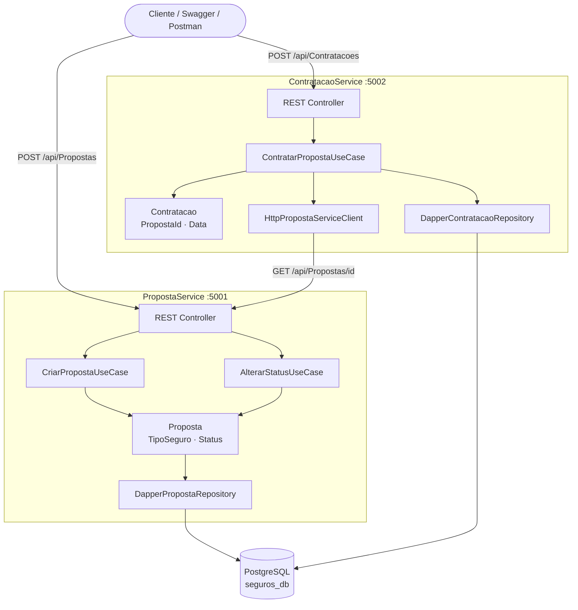

# 🛡️ Proposta de Seguros

Sistema de gerenciamento de propostas de seguro desenvolvido como teste técnico,
utilizando Arquitetura Hexagonal (Ports & Adapters), .NET 10 e PostgreSQL.

## Visão Geral

O sistema é composto por dois microserviços independentes:

| Serviço | Responsabilidade | Porta |
|---|---|---|
| **PropostaService** | Criar e gerenciar propostas de seguro | 5001 |
| **ContratacaoService** | Contratar propostas aprovadas | 5002 |

## Arquitetura



## Tecnologias

- .NET 10 · C#
- PostgreSQL 16
- Dapper (micro ORM)
- RabbitMQ (mensageria — bônus)
- FluentValidation
- xUnit · Moq · Bogus · FluentAssertions
- Docker · Docker Compose
- Swagger / OpenAPI
- ASP.NET Health Checks

## Tipos de Seguro (BMG)

| Código | Tipo | Valor Mínimo |
|--------|------|--------------|
| 1 | SeguroFGTSProtegido | R$ 50,00 |
| 2 | SeguroVidaFamiliar | R$ 30,00 |
| 3 | SeguroCartaoProtegido | R$ 15,00 |
| 4 | ProtecaoCreditoTrabalhador | R$ 25,00 |
| 5 | SeguroContaCelularProtegidos | R$ 10,00 |

---

## Como Executar

### Opção 1 — Docker na VPS (recomendado)

```bash
ssh root@2.25.122.11
cd /home/projetos/proposta-seguros
./scripts/apply.sh
```

### Opção 2 — Docker local

```bash
git clone https://github.com/josehelioaraujo/proposta-seguros.git
cd proposta-seguros
cp .env.example .env
docker compose up --build -d
```

### Opção 3 — Local sem Docker

```bash
# Terminal 1 — PropostaService
cd src/PropostaService/PropostaService.Api
dotnet run

# Terminal 2 — ContratacaoService
cd src/ContratacaoService/ContratacaoService.Api
dotnet run
```

---

## URLs

### VPS Hostinger

| Serviço | URL |
|---|---|
| PropostaService — Swagger | http://2.25.122.11:5001 |
| ContratacaoService — Swagger | http://2.25.122.11:5002 |
| RabbitMQ — Painel | http://2.25.122.11:15672 |

### Local

| Serviço | URL |
|---|---|
| PropostaService — Swagger | http://localhost:5001 |
| ContratacaoService — Swagger | http://localhost:5002 |
| RabbitMQ — Painel | http://localhost:15672 |

---

## Endpoints

### PropostaService

| Método | Rota | Descrição |
|--------|------|-----------|
| POST | /api/Propostas | Cria uma proposta |
| GET | /api/Propostas | Lista todas as propostas |
| GET | /api/Propostas/{id} | Busca proposta por ID |
| PATCH | /api/Propostas/{id}/status | Altera status da proposta |

### ContratacaoService

| Método | Rota | Descrição |
|--------|------|-----------|
| POST | /api/Contratacoes | Contrata uma proposta aprovada |
| GET | /api/Contratacoes/{id} | Busca contratação por ID |

### Health Checks

| Rota | Descrição | VPS | Local |
|------|-----------|-----|-------|
| /health | Status geral | http://2.25.122.11:5001/health | http://localhost:5001/health |
| /health/live | Liveness — API viva? | http://2.25.122.11:5001/health/live | http://localhost:5001/health/live |
| /health/ready | Readiness — banco ok? | http://2.25.122.11:5001/health/ready | http://localhost:5001/health/ready |
| /health | Status geral | http://2.25.122.11:5002/health | http://localhost:5002/health |
| /health/live | Liveness | http://2.25.122.11:5002/health/live | http://localhost:5002/health/live |
| /health/ready | Readiness — banco + proposta-service + rabbitmq | http://2.25.122.11:5002/health/ready | http://localhost:5002/health/ready |

---

## Testando via Postman

### 1. Importar os arquivos

```
Postman → Import → seleciona os 3 arquivos da pasta docs/postman/:
├── proposta-seguros.postman_collection.json
├── env-local.json
└── env-vps.json
```

### 2. Selecionar o ambiente

```
Canto superior direito do Postman:
├── "Local"          → testa em http://localhost:500x
└── "VPS Hostinger"  → testa em http://2.25.122.11:500x
```

### 3. Rodar o fluxo completo

```
Clica com botão direito em "04 — Fluxo Completo"
→ Run folder
→ Run Proposta de Seguros
→ 5 requests executados em sequência ✅
```

### Estrutura da Collection

```
01 — Health Checks      → verifica saúde dos serviços
02 — PropostaService    → todos os cenários de proposta
03 — ContratacaoService → todos os cenários de contratação
04 — Fluxo Completo     → executa o fluxo end-to-end
```

---

## Testes Unitários

```bash
dotnet test .\proposta-seguros.sln
```

```
Resultado esperado:
total: 13 | falhou: 0 | bem-sucedido: 13
```

---

## Feature Flags

| Flag | Valor | Comportamento |
|------|-------|---------------|
| `Features:UsarBancoDados` | `false` | InMemory (padrão dev) |
| `Features:UsarBancoDados` | `true` | PostgreSQL via Dapper |
| `Features:UsarRabbitMQ` | `false` | Sem mensageria (padrão) |
| `Features:UsarRabbitMQ` | `true` | Publica eventos no RabbitMQ |

### Scripts de operação (VPS)

```bash
./scripts/apply.sh                    # aplica as flags do .env
./scripts/set-banco.sh --enable       # liga PostgreSQL
./scripts/set-banco.sh --disable      # liga InMemory
./scripts/set-rabbitmq.sh --enable    # liga RabbitMQ
./scripts/set-rabbitmq.sh --disable   # desliga RabbitMQ
./scripts/update.sh                   # git pull + rebuild
./scripts/logs.sh --proposta          # logs PropostaService
./scripts/logs.sh --contratacao       # logs ContratacaoService
./scripts/status.sh                   # status dos containers
```

---

## Documentação

- 📋 [Enunciado do Projeto](docs/enunciado.md)
- 📬 [Postman Collection](docs/postman/)
