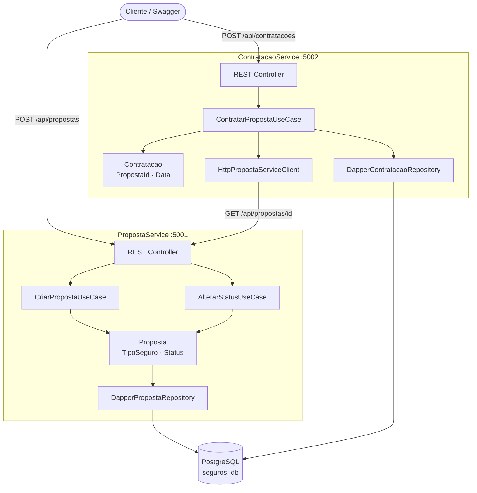

# 🛡️ Proposta de Seguros

Sistema de gerenciamento de propostas de seguro desenvolvido como teste técnico,
utilizando Arquitetura Hexagonal (Ports & Adapters), .NET 8 e PostgreSQL.

## Visão Geral

O sistema é composto por dois microserviços independentes:

| Serviço | Responsabilidade | Porta |
|---|---|---|
| **PropostaService** | Criar e gerenciar propostas de seguro | 5001 |
| **ContratacaoService** | Contratar propostas aprovadas | 5002 |

## Arquitetura



## Tecnologias

- .NET 8 · C#
- PostgreSQL 16
- Dapper (micro ORM)
- FluentValidation
- xUnit · Moq · FluentAssertions
- Docker · Docker Compose
- Swagger / OpenAPI

## Como Executar

### Docker (recomendado)
```bash
docker compose up --build
```

### Local
```bash
# PropostaService
cd src/PropostaService/PropostaService.Api
dotnet run

# ContratacaoService
cd src/ContratacaoService/ContratacaoService.Api
dotnet run
```

## Testes

```bash
dotnet test
```

## Documentação

- 📋 [Enunciado do Projeto](docs/enunciado.md)
- 🏗️ Arquitetura detalhada — em breve
- 📡 Endpoints — em breve
- 📝 Decisões técnicas — em breve
